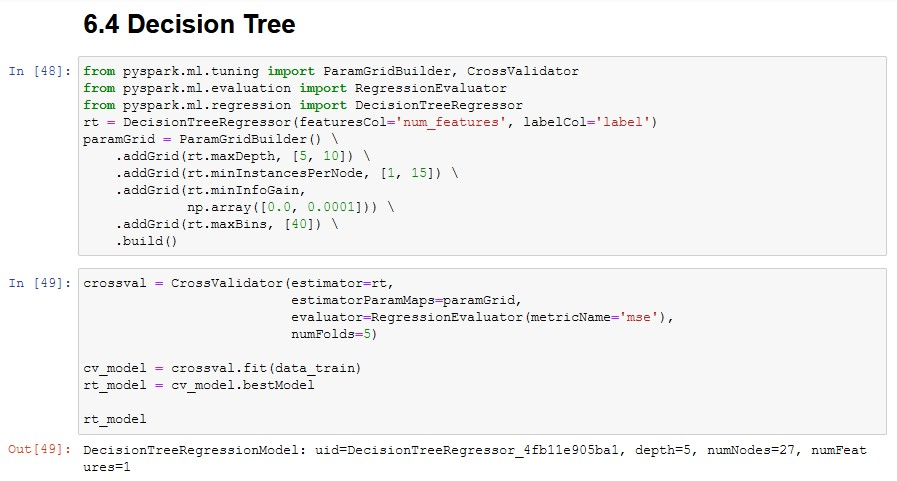

Author: Andreas Traut  
Date: 08.05.2020  (Updates 24.07.2020)
[Download as PDF](https://github.com/AndreasTraut/Machine-Learning-with-Python/raw/master/Machine-Learning-with-Python_AndreasTraut.pdf)

# Machine Learning with Python

After having learnt visualization techniques in Python (which I showed in my repository "Visualization-of-Data-with-Python", see https://github.com/AndreasTraut/Visualization-of-Data-with-Python) I started working on different datasets with the aim to apply machine learning algorithms (e.g. [Decision Tree](https://de.wikipedia.org/wiki/Entscheidungsbaum) to name only one). 

In my examples in this repository here I will use [Jupyter-Notebooks](https://jupyter.org/), which is a widespread standard today. The first Jupyter-Notebooks have been developed 5 years ago (in 2015). Since my first programming experience was more than 25 years ago (I started with [GW-Basic](https://de.wikipedia.org/wiki/GW-BASIC) then [Turbo-Pascal](https://de.wikipedia.org/wiki/Turbo_Pascal) and so on...) I quickly learnt the advantages of using Jupyter-Notebooks. 

**But** I missed the comfort of an [IDE](https://de.wikipedia.org/wiki/Integrierte_Entwicklungsumgebung) from the very first days!

Therefore: in my examples in this repository here I will also work with Python ".py" files. These ".py" can be executed in an IDE, like e.g. Spyder-IDE (see https://www.spyder-ide.org/)

**Why is it important for me to point this out so early in a learning process?**  
In my opinion Jupyter-Notebooks are good for the first examinations of data and for documenting procedures and up to a certain degree also for sophisticated data science. But it might be a good idea to learn very early how to work with an IDE. Think about how to use what has been developed so far later in a bigger environment (for example a [Lambda-Architecture](https://de.wikipedia.org/wiki/Apache_Hadoop#Lambda-Architektur), but you can take whatever other environment, which requires robustness&stability). I point this out here, because after having read several e-Books and having participated in seminars I see that IDEs are not in the focus. 

Therefore the *first example* uses a Jupyter-Noteook in order to learn the standard procedures (e.g. data-cleaning&preparing, model-training,...). 

The *second example* is for being used in an IDE. I will split it up into two parts: 
  * 2.1 for "Small Data" will use the ["Scikit-Learn"](https://scikit-learn.org/stable/) python machine learning library
  * 2.2 for "Big Data" will will use the ["Apache MLib"](https://spark.apache.org/mllib/) scalable machine learning library

## 1. Movies Database Example

A good starting point for finding useful datasets is "Kaggle" (www.kaggle.com). I downloaded the following movies dataset: 

https://www.kaggle.com/isaactaylorofficial/imdb-10000-most-voted-feature-films-041118

The dataset from Kaggle contains the following columns:

Rank | Title | Year | Score | Metascore | Genre | Vote | Director | Runtime | **Revenue** | Description | RevCat

In this example I want to predict the **"Revenue"** based on the other information, which I have for each movie (e.g. every movie has a year, a scoring, a title ...). There are some "NaN"-values in the column "Revenue" and instead of filling them with an assumption (e.g. median-value) as I did in another Jupiter-Notebook (see [here](https://github.com/AndreasTraut/Machine-Learning-with-Python/blob/master/Movies%20Machine%20Learning%20-%20StratifiedSample.ipynb)), I wanted to predict these values. You might guess the conclusion already: predicting the revenue based on the available information as shown above (the columns) might not work. But essential to me is more to follow a well established standard-process of data-cleaning, data-preparing, model-training and error-calculation in this example in order to learn how to apply this process to better datasets, than the movies-dataset, later. 

Therefore, here is how I approached the problem step-by-step: 
- I separated the rows with "NaN"-values in column "Revenue"

- I drew a stratified sample (based on "Revenue") on this remaining dataset and I received a training dataset and testing dataset:

- I created a pipeline to fill the "NaN"-value in other columns (e.g. "Metascore", "Score").

- used the training dataset and fittet it with the "DecisionTreeRegressor" model

- verified with a cross-validation, how good this model/parameters are

- did a prediction on a subset of the testing dataset and did a side-by-side comparison of prediction and true value

- performed a prediction on the testing dataset and calculated the mean-squared error

**The conclusion of this machine learning example is** obvious: it is rather not possible to predict the "Revenue" based on the available information (the most useful numerical features were "year", "score", ... and the other categorical like "genre" don't seem to have much more added value in my opinion). 

Please find the complete Jupyter Notebook here: 

https://github.com/AndreasTraut/Machine-Learning-with-Python/blob/master/Movies%20Machine%20Learning%20-%20Predict%20NaNs.ipynb

## 2. Step-by-step Python-Code for Machine Learning"

As said above, the *second example* is for being used in an IDE. I will split it up into two parts: 
  * 2.1 will use the ["Scikit-Learn"](https://scikit-learn.org/stable/) python machine learning library
  * 2.2 will be an example for a ["Big-Data"](https://de.wikipedia.org/wiki/Big_Data) environment and uses the ["Apache MLib"](https://spark.apache.org/mllib/) scalable machine learning library. Understanding the concept of "Big-Data" and how to differenciate "standard" machine learning from a "scalable" environment is not easy. I recommend a separate training. At the end we will have a structure of steps which are recommended to follow: 
  

  
As Jupyter Notebooks are not always the best environment for Python coding (e.g. Debugging), I extracted the most essential parts of Chapter 2 of Aurelien Geron "Machine Learning with Scikit-Learn & Tensorflow", sorted and arranged the code fragments slightly and created the following structured Python code for being used for example in the [Spyder-IDE](https://www.spyder-ide.org/). The structure of the Python code is a bit similar to the steps, which I followed in the Jupyter Notebooks above and are as follows (you will find these sections also in the ".py" file): 

### 2.1 Using "scikit-learn"

Let's start with the "scikit-learn" ("SmallData", if you want): 

 1. create index   
	 1.1 Alternative 1: generate id with static data
	 

	 1.2 Alternative 2: generate stratified sampling
	 

	 1.3 verify if stratified example is good
	 

 2. Discover and visualize the data to gain insights
 

 3. prepare for Machine Learning  
	 3.1 find all NULL-values
	 

	 3.2 remove all NULL-values
	 

 4. Use "Imputer" to clean NaNs
 

 5. treat "categorial" inputs
 

 6. custom transformer and pipelines  
	 6.1 custom transformer
	 

	 6.2 pipelines
	 

 7. select and train model  
	 7.1 LinearRegression model
	 

	 7.2 DecisionTreeRegressor model
	 

 8. crossvalidation  
	 8.1 for DecisionTreeRegressor
	 

	 8.2 for LinearRegression
	 

	 8.3 for RandomForestRegressor
	 

	 8.4 for ExtraTreesRegressor
	 

 9. Save Model
 

 10. Optimize Model  
	 10.1 GridSearchCV
		 10.1.1 GridSearchCV on RandomForestRegressor
		 

		 10.1.2 GridSearchCV on LinearRegressor
		 

	 10.2 Randomized Search
	 

	 10.3 Analyze best models
	 

 11. Evaluate final model on test dataset
 

### 2.2 Using "Apache Machine-Learning" Libary (Big Data)

Next is to extend this approach to the Apache Spark environment (the "Big Data" environment). The steps are a bit similar (e.g. data-cleaning, preprocessing), to "scikit-learn" but the technical environment for running the code is different and also the code itself is different. 

The technical environment: 

There are differents ways to approach the Apache Spark and Hadoop environment: you can install it on your own computer (which I found rather difficult because of lack of userfriendly and easy understandable documentation). Or you can dive into a Cloud environment, like e.g. Microsoft Azure or Amazon EWS or Google Cloud and try to get a virtual machine up and running for your purposes. Have a look at my [documentation](https://github.com/AndreasTraut/Experiences-with-MicrosoftAzure), where I shared my experiences, which I had with Microsoft Azure [here](https://github.com/AndreasTraut/Experiences-with-MicrosoftAzure). 

For the following explanation I decided to use [Docker](https://www.docker.com/). What is Docker? Docker is "an open-source project that automates the deployment of software applications inside containers by providing an additional layer of abstraction and automation of OS-level virtualization on Linux." Learn from the [Docker-Curriculum](https://docker-curriculum.com/) how it works. I found an container, which had Apache Spark Version 3.0.0 and Hadoop 3.2 installed and built my machine-learning code (using pyspark) on top of this container. 

I shared my code and developments on Docker-Hub in the following repository [here](https://hub.docker.com/repository/docker/andreastraut/machine-learning-pyspark). After having installed Docker you will  need to open Windows Powershell and type the following: 

You will see in your Docker Dashborad that a container is running: 

After having opened your browser (e.g. Firefox-Browser), navigate to "localhost:8888" (8888 is the port, which will be opened). 

You will see a Jupyter-Notebook (which contains the Machine-Learning Code) and a folder named "data" (which contains the raw-data and preprocessed data). 

When you open the Jupyter-Notebook, you will see, that Apache Spark Verison 3.0.0 an dHadoop Version 3.2 is installed. 

Initializing a Spark sessions works with the following commands: 

After then the data-cleaning and data preparation (eliminating of null values, visualization techniques) work pretty similar to the "Small data" (Sklearn) approach. If you want to persist (=save) your intermediate you can do it as follows: 

I included some examples of how features can be extracted, transformed and selected in the Jupyter-Notebook. Just to mention a few here: the "StringIndexer", "OneHotEncoder" and "VectorAssembler" work as follows: 

After having extracted, transformed and selected features you will want to apply some models, for example the "OLS Regression": 

or a "Decision Tree" Modell using a cross validator: 

To summarize the whole coding structure have a look at this mind-map and structure below: 

 0. Initialize Spark     
     0.1 Create Spark Context and Spark Session  
     0.2 Read CSV  
     0.3 Dataset Properties and some Select, Group and Aggregate Methods  
     0.4 Write as Parquet or CSV  
     0.5 Read Parquet  
     0.6 How to stop a Spark Session and Spark Context  

 1. Cleaning the data     
     1.1 Show number of rows and columns and do some visualizations  
     1.2 Replacing and Casting  
     1.3 Null-Values  
     1.4 String Values  

 2. Model-specific preprocessing    
     2.0 Check missing entries and define userdefined scatter plot  
     2.1 StringIndexer  
     2.2 OntHotEncoder  
     2.3 VectorAssembler  
     2.4 CountVectorizer  

 3. Aligning and numerating Features and Labels    
     3.1 Aligning  
     3.2 Numerating  

 4. Pipelines  

 5. Training data and Testing data  

 6. Apply models and evaluate    
     6.1 Ordinary Least Square Regression  
     6.2 Ridge Regression  
     6.3 Lasso Regression  
     6.4 Decision Tree  
    
 7. Minhash und Local-Sensitive-Hashing (LSH)  

 8. Alternative-Least-Square (ALS)    
     8.1. Datapreparation for ALS  
     8.2 Build the recommendation model using alternating least squares (ALS)  
     8.3 Get recommendations  
     8.4 Clustering of Users with K-Means  
     8.5 Perform a PCA and draw the 2-dim projection  
