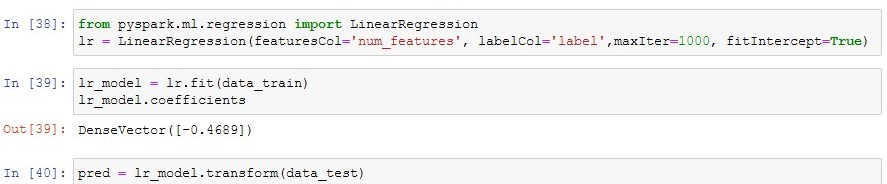
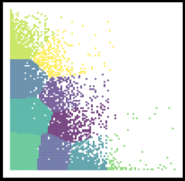

Author: Andreas Traut    
Date: 08.05.2020  (Updates 24.07.2020)  
[Download as PDF](https://github.com/AndreasTraut/Machine-Learning-with-Python/raw/master/Machine-Learning-with-Python_AndreasTraut.pdf)

[TOC]

# Machine Learning with Python

## 0. Introduction

### a) Aim of this repository: "Small Data" versus "Big Data"

After having learnt visualization techniques in Python (which I showed in my repository ["Visualization-of-Data-with-Python"](https://github.com/AndreasTraut/Visualization-of-Data-with-Python)), I started working on different datasets with the aim to learn and apply machine learning algorithms. I was particularly interested in better **understanding the differences and similarities of "Small Data" (Scikit-Learn) approaches versus the "Big Data" (Spark) approaches!**

Therefore I tried to focus more on this "comparison" question of "Small Data" coding vs "Big Data" coding instead of digging into too many details of each of these approaches. I haven't seen many comparisons of "Small Data" vs "Big Data" coding and I think understanding this is interesting and important. 

### b) Motivation for IDEs

I will use [Jupyter-Notebooks](https://jupyter.org/), which is a widespread standard today, but I will also use [Integrated Development Environments (IDEs)](https://de.wikipedia.org/wiki/Integrierte_Entwicklungsumgebung). The first Jupyter-Notebooks have been developed 5 years ago (in 2015). Since my first programming experience was more than 25 years ago (I started with [GW-Basic](https://de.wikipedia.org/wiki/GW-BASIC) then [Turbo-Pascal](https://de.wikipedia.org/wiki/Turbo_Pascal) and so on and I am also familiar with [MS-DOS](https://de.wikipedia.org/wiki/MS-DOS)). I quickly learnt the advantages of using Jupyter-Notebooks. **But** I missed the comfort of an [IDE](https://de.wikipedia.org/wiki/Integrierte_Entwicklungsumgebung) from the very first days!

Why is it important for me to mention the IDEs out so early in a learning process? In my opinion Jupyter-Notebooks are good for the first examinations of data and for documenting procedures and up to a certain degree also for sophisticated data science. But it might be a good idea to learn very early how to work with an IDE. Think about how to use what has been developed so far later in a bigger environment (for example a [Lambda-Architecture](https://de.wikipedia.org/wiki/Apache_Hadoop#Lambda-Architektur), but you can take whatever other environment, which requires robustness&stability). I point this out here, because after having read several e-Books and having participated in seminars I see that IDEs are not in the focus.  

Therefore: in my examples in this repository here I will also work with Python ".py" files. These ".py" can be executed in an IDE, like e.g. [Spyder-IDE](https://www.spyder-ide.org/), which can be downloaded for free and looks like this: 

### c) Structure of this repository

#### (i) First part: "Movies Database" example

Therefore the *first example* uses a [Jupyter-Notebook](https://jupyter.org/) in order to learn the standard procedures (e.g. data-cleaning & preparing, model-training,...). I worked on data converting movies and their revenues. 

#### (ii) Second part: Scikit-Learn Example ("Small Data")

The *second example* is for being used in an IDE (integrated developer environment), like the [Spyder-IDE](https://www.spyder-ide.org/) from the [Anaconda distribution](https://www.anaconda.com/) and apply the ["Scikit-Learn Python Machine Learning Library"](https://scikit-learn.org/stable/)  (you may call this example a "Small Data" example if you want). I will show you a typical structure for a machine-learning example and put it into a mind-map. The same structure will be applied on the third example. 

#### (iii) Third part: Spark Example ("Big Data")

The *third example* is a "Big Data" example and will use a [Docker environment](https://www.docker.com/) and apply the ["Apache Machine Learning Library"](https://spark.apache.org/mllib/), a scalable machine learning library. The mind-map from the second part will be extended and aligned to the second example. 

In this example I also show some *Big Data Visualizations techniques*, show how the *K-Means Clustering Algorithm in Apache Spark ML* works and explain the *Map-Reduce* programming model on a Word-Count example. 

#### (iv) Summary Mind-Map

I provide a summary mind-map, which possibly helps you to structure your code. There are lots of similarities between "Small Data" and "Big Data". 

#### (v) Digression (Excurs) to Big Data Visualization and K-Means Clustering Algorithm and Map-Reduce

In this Digression (Excurs) I will provide some examples for Big Data Visualization, K-Means Clustering and Map-Reduce. 

### d) Future learnings and coding & data sources 

For <u>all</u> of these topics various tutorials, documentation, coding examples and guidelines can be found in the internet **for free**! The Open Source Community is an incredible treasure trove and enrichment that positively drives many digital developments: [Scikit-Learn](https://github.com/scikit-learn/scikit-learn), [Apache Spark](https://github.com/apache/spark), [Spyder](https://github.com/spyder-ide/spyder), [GitHub](https://github.com/github), [Tensorflow](https://github.com/tensorflow/tensorflow) and also [Firefox](https://github.com/mozilla), [Signal](https://github.com/signalapp), [Threema](https://github.com/threema-ch), [Corona-Warnapp](https://github.com/corona-warn-app)... to be mentionned. There are many positive examples of sharing code and data "for free". 

<u>Coding:</u> 

If you Google for example *"how to prepare and clean the data with spark"*, you will find tons of documents around *"removing null values"* or *"encoders"* (like the OneHotEncoder for treating categorical inputs) or *"pipelines"* (for putting all the steps in an efficient, customizable order) so on. You will be overwhelmed of all this. Some resources to mention are the [official documentation](https://spark.apache.org/docs/latest/ml-guide.html) and a few more Github repositories like e.g. [tirthajyoti/Spark-with-Python](https://github.com/tirthajyoti/Spark-with-Python) (MIT licence), [Apress/learn-pyspark](https://github.com/Apress/learn-pyspark) (Freeware License), [mahmoudparsian/pyspark-tutorial](https://github.com/mahmoudparsian/pyspark-tutorial) (Apache License v2.0). What I will do here in my repository is nothing more than putting it together so that it works for my problem (which can be challenging as well sometimes). Adapting it for your needs should be easier from this point on. 

<u>Data:</u>

If you would like to do further analysis or produce alternate visualizations of the Airbnb-data, you can download them from [here](http://insideairbnb.com/get-the-data.html). It is available below under a [Creative Commons 1.0 Universal "Public Domain Dedication"](http://creativecommons.org/publicdomain/zero/1.0/) license. The data for the Vermont-Vendor-Payments can be downloaded from [here](https://data.vermont.gov/Finance/Vermont-Vendor-Payments/786x-sbp3) and are available under the [Open Data Commons Open Database License](http://opendatacommons.org/licenses/odbl/1.0/). The movies database doesn't even mention a license and is from [Kaggle](https://www.kaggle.com/isaactaylorofficial/imdb-10000-most-voted-feature-films-041118/metadata). There you find a lot of more datasets and also coding examples for your studies. 

## I. "Movies Database" Example 

A good starting point for finding useful datasets is "Kaggle" (www.kaggle.com). I downloaded the movies dataset from [here](https://www.kaggle.com/isaactaylorofficial/imdb-10000-most-voted-feature-films-041118). The dataset from Kaggle contains the following columns:

Rank | Title | Year | Score | Metascore | Genre | Vote | Director | Runtime | **Revenue** | Description | RevCat

In this example I want to predict the **"Revenue"** based on the other information, which I have for each movie (e.g. every movie has a year, a scoring, a title ...). There are some "NaN"-values in the column "Revenue" and instead of filling them with an assumption (e.g. median-value) as I did in another Jupiter-Notebook (see [here](https://github.com/AndreasTraut/Machine-Learning-with-Python/blob/master/Movies%20Machine%20Learning%20-%20StratifiedSample.ipynb)), I wanted to predict these values. You might guess the conclusion already: predicting the revenue based on the available information as shown above (the columns) might not work. But essential to me is more to follow a well established standard-process of data-cleaning, data-preparing, model-training and error-calculation in this example in order to learn how to apply this process to better datasets, than the movies-dataset, later. 

Therefore, here is how I approached the problem step-by-step: 

#### 1. Separate "NaN"-values

I separated the rows with "NaN"-values in column "Revenue"

#### 2. Draw a stratified sample

I drew a stratified sample (based on "Revenue") on this remaining dataset and I received a training dataset and testing dataset:

#### 3. Create a pipeline

I created a pipeline to fill the "NaN"-value in other columns (e.g. "Metascore", "Score").

#### 4. Fit the model

I used the training dataset and fitted it with the "DecisionTreeRegressor" model

#### 5. Cross-validation

I verified with a cross-validation, how good this model/parameters are

#### 6. Prediction 

I did a prediction on a subset of the testing dataset and did a side-by-side comparison of prediction and true value

I performed a prediction on the testing dataset and calculated the mean-squared error

#### 7. Conclusion 

The conclusion of this machine learning example is obvious: it is rather not possible to predict the "Revenue" based on the available information (the most useful numerical features were "year", "score", ... and the other categorical like "genre" don't seem to have much more added value in my opinion). 

Please find the complete Jupyter Notebook here: 

https://github.com/AndreasTraut/Machine-Learning-with-Python/blob/master/Movies%20Machine%20Learning%20-%20Predict%20NaNs.ipynb

If you want to run the code immediately without installing the required "Jupyter environment" then you can use this Deepnote-Link:  

https://beta.deepnote.com/project/754094f0-3c01-4c29-b2f3-e07f507da460

## II. "Small Data" Machine Learning using "Scikit-Learn"

In my opinion Jupyter Notebooks are **not** always the best environment for learning to code! I agree, that Jupyter Notebooks are nice for doing documentation of python code. It really looks beautiful. But I prefer debugging in an IDE instead of a Jupyter Notebook: having the possibility to set a breakpoint can be a pleasure for my nerves, specially if you have longer programs. Some of my longer Jupyter Notebooks feel from the hundreds line of code onwards more like pain than like anything helpful. And I also prefer having a "help window" or a "variable explorer", which is smoothly integrated into the IDE user interface. And there are a lot more advantages why getting familiar with an IDE is a big advantage compared to the very popular Jupyter Notebooks! I am very surprised, that everyone is talking about Jupyter Notebooks but IDEs are only mentioned very seldom. But maybe my preferences are also a bit different, because I grew up in a [MS-DOS](https://de.wikipedia.org/wiki/MS-DOS) environment. :-) 

I choose in this *second example* the [Spyder-IDE](https://www.spyder-ide.org/) and worked on "[Scikit-Learn](https://scikit-learn.org/stable/)", a very popular python machine learning library. The basis of this code are some Jupyter-Notebooks, which Aurelien Geron provided (under the Apache License 2.0) in his book "Machine Learning with Scikit-Learn & Tensorflow". But as I didn't like at all that his code are Jupyter Notebooks (how can you re-use it efficiently for your own purposes?), so I wanted to work on it: I extracted the most essential parts of chapter 2, then sorted, arranged and modified the code fragments and created the following structured Python code. The structure of the Python code is a bit similar to the steps, which I followed in the Movies Database example above (you will find these sections also in the ".py" file). 

So let's start with the "scikit-learn" ("SmallData", if you want). I will align this structure to the Spark "Big Data" mind map below in order to learn from each of this two approaches. 

#### 1. create index   

##### 1.1 Alternative 1: generate id with static data

##### 1.2 Alternative 2: generate stratified sampling

##### 1.3 verify if stratified example is good

#### 2. Discover and visualize the data to gain insights

#### 3. prepare for Machine Learning  

##### 3.1 find all NULL-values

##### 3.2 remove all NULL-values

#### 4. Use "Imputer" to clean NaNs

#### 5. treat "categorial" inputs

#### 6. custom transformer and pipelines  

##### 6.1 custom transformer

#####  6.2 pipelines

#### 7. select and train model  

##### 7.1 LinearRegression model

#####  7.2 DecisionTreeRegressor model

#### 8. crossvalidation  

##### 8.1 for DecisionTreeRegressor

#####  8.2 for LinearRegression

##### 8.3 for RandomForestRegressor

##### 8.4 for ExtraTreesRegressor

#### 9. Save Model

#### 10. Optimize Model  

#####  10.1 GridSearchCV

###### 	 10.1.1 GridSearchCV on RandomForestRegressor	 

###### 	 10.1.2 GridSearchCV on LinearRegressor

#####  10.2 Randomized Search

#####  10.3 Analyze best models

#### 11. Evaluate final model on test dataset

## III. "Big Data" Machine Learning using the "Spark ML Library"

This will be an example for a ["Big-Data"](https://de.wikipedia.org/wiki/Big_Data) environment and uses the ["Apache MLib"](https://spark.apache.org/mllib/) scalable machine learning library. Various tutorials, documentation, "code-fragments" and guidelines can be found in the internet **for free** (at least for your private use). The best is in my opinion the [official documentation](https://spark.apache.org/docs/latest/ml-guide.html). A few more helpful sources are the following GitHub repositories: 

- [tirthajyoti/Spark-with-Python](https://github.com/tirthajyoti/Spark-with-Python) (MIT license)
- [Apress/learn-pyspark](https://github.com/Apress/learn-pyspark) (Freeware License)
- [mahmoudparsian/pyspark-tutorial](https://github.com/mahmoudparsian/pyspark-tutorial) (Apache License v2.0)

Concerning the topic **"Big Data"** I want to add the following: I passed a certification as *"Data Scientist Specialized in Big Data Analytics"*. I must say: Understanding the concept of "Big-Data" and how to differentiate "standard" machine learning from a "scalable" environment is not easy. I recommend a separate training! Some steps are a bit similar to "scikit-learn" (e.g. data-cleaning, preprocessing), but the technical environment for running the code is different and also the code itself is different. 

I added a **"Digression (Excurs)"** at the end of this document which covers the topics *"Big Data Visualization"*, *"K-Means-Clustering in Spark"* and *"Map-Reduce"* (one of the [powerful programming models for Big Data](https://de.wikipedia.org/wiki/MapReduce)). 

Let's start with the structure, which I put into a mind map (you can download it from this repository). I aligned the structure to the SkLearn mind map above in order to learn from each of this two approaches. 

There are different ways to approach the Apache Spark and Hadoop environment: you can install it on your own computer (which I found rather difficult because of lack of user-friendly and easy understandable documentation). Or you can dive into a Cloud environment, like e.g. Microsoft Azure or Amazon EWS or Google Cloud and try to get a virtual machine up and running for your purposes. Have a look at my [documentation](https://github.com/AndreasTraut/Experiences-with-MicrosoftAzure), where I shared my experiences, which I had with Microsoft Azure [here](https://github.com/AndreasTraut/Experiences-with-MicrosoftAzure). 

For the following explanation I decided to use [Docker](https://www.docker.com/). What is Docker? Docker is *"an open-source project that automates the deployment of software applications inside containers by providing an additional layer of abstraction and automation of OS-level virtualization on Linux."* Learn from the [Docker-Curriculum](https://docker-curriculum.com/) how it works. I found an container, which had Apache Spark Version 3.0.0 and Hadoop 3.2 installed and built my machine-learning code (using pyspark) on top of this container. 

I shared my code and developments on Docker-Hub in the following repository [here](https://hub.docker.com/repository/docker/andreastraut/machine-learning-pyspark). After having installed the Docker application you will need to pull my "machine-learning-pyspark" image to your computer: 

`docker pull andreastraut/machine-learning-pyspark`

Then open Windows Powershell and type the following: 

`docker run -dp 8888:8888 andreastraut/machine-learning-pyspark:latest`

You will see in your Docker Dashborad that a container is running: 

After having opened your browser (e.g. Firefox-Browser), navigate to "localhost:8888" (8888 is the port, which will be opened). 

The folder "data" contains the datasets. If you would like to do further analysis or produce alternate visualizations of the Airbnb-data, you can download them from [here](http://insideairbnb.com/get-the-data.html). It is available below under a [Creative Commons CC0 1.0 Universal (CC0 1.0) "Public Domain Dedication"](http://creativecommons.org/publicdomain/zero/1.0/) license. The data for the Vermont-Vendor-Payments can be downloaded from [here](https://data.vermont.gov/Finance/Vermont-Vendor-Payments/786x-sbp3) and are available under the [Open Data Commons Open Database License](http://opendatacommons.org/licenses/odbl/1.0/). 

When you open the Jupyter-Notebook, you will see, that Apache Spark Version 3.0.0 and Hadoop Version 3.2 is installed:

#### 0. Initialize Spark

Initializing a Spark sessions works and reading a CSV file can by done with the following commands (see more documentation [here](https://spark.apache.org/docs/latest/api/python/pyspark.sql.html#pyspark.sql.SparkSession) and also have a look at a ["Get Started Guide"](https://spark.apache.org/docs/latest/sql-getting-started.html#starting-point-sparksession)):

##### 0.1 Create Spark Context and  Spark Session

##### 0.2 Read CSV

##### 0.3 Dataset Properties and some Select, Group and Aggregate Methods

After then the data-cleaning and data preparation (eliminating of null values, visualization techniques) work pretty similar to the "Small data" (Sklearn) approach. 

##### 0.4 Write as Parquet or CSV

If you want to persist (=save) your intermediate you can do it as follows: 

##### 0.5 Read Parquet

See jupyter notebook. 

##### 0.6 How to stop a Spark Session and Spark Context

See jupyter notebook. 

#### 1. Cleaning the data     

##### 1.1 Show number of rows and columns and do some visualizations  

##### 1.2 Replacing and Casting  

##### 1.3 Null-Values  

##### 1.4 String Values  

#### 2. Model-specific preprocessing    

##### 2.0 Check missing entries and define userdefined scatter plot  

##### 2.1 StringIndexer  

I included some examples of how features can be extracted, transformed and selected in the Jupyter-Notebook (see more documentation [here](https://spark.apache.org/docs/latest/ml-features.html)). Just to mention a few here: the ["StringIndexer"](https://spark.apache.org/docs/latest/ml-features.html#stringindexer), ["OneHotEncoder"](https://spark.apache.org/docs/latest/ml-features.html#onehotencoder) and ["VectorAssembler"](https://spark.apache.org/docs/latest/ml-features.html#vectorassembler) work as follows: 

##### 2.2 OntHotEncoder  

##### 2.3 VectorAssembler  

##### 2.4 CountVectorizer  

#### 3. Aligning and numerating Features and Labels    

##### 3.1 Aligning  

##### 3.2 Numerating  

#### 4. Pipelines  

#### 5. Training data and Testing data  

#### 6. Apply models and evaluate    

##### 6.1 Ordinary Least Square Regression  

After having extracted, transformed and selected features you will want to apply some models, which are documented [here](https://spark.apache.org/docs/latest/ml-classification-regression.html), for example the ["OLS Regression](https://spark.apache.org/docs/latest/ml-classification-regression.html#linear-regression)": 

##### 6.2 Ridge Regression  

##### 6.3 Lasso Regression  

##### 6.4 Decision Tree  

#### 7. Minhash und Local-Sensitive-Hashing (LSH) 

see example: https://github.com/AndreasTraut/Deep_learning_explorations

#### 8. Alternative-Least-Square (ALS)    

##### 8.1. Datapreparation for ALS  

##### 8.2 Build the recommendation model using alternating least squares (ALS)  

##### 8.3 Get recommendations  

##### 8.4 Clustering of Users with K-Means 

see example: https://hub.docker.com/repository/docker/andreastraut/machine-learning-pyspark  

##### 8.5 Perform a PCA and draw the 2-dim projection  

## IV. Summary Mind-Map

To summarize the whole coding structure have a look at the following and also the provided mind-maps. My mind map below may help you to structure your code: 

## V. Digression (Excurs) to Big Data Visualization and K-Means Clustering Algorithm and Map-Reduce

| Digression (Excurs) to Big Data Visualization and K-Means Clustering Algorithm and Map-Reduce |
| :----------------------------------------------------------- |
| **(i) Big Data Visualization:** You will see a Jupyter-Notebook (which contains the Machine-Learning Code) and a folder named "data" (which contains the raw-data and preprocessed data). As you can see: I also worked on a 298 MB big csv-file (["Vermont_Vendor_Payments.csv"](https://data.vermont.gov/Finance/Vermont-Vendor-Payments/786x-sbp3)), which I couldn't open in Excel, because of the huge size. This file contains a list of all state of Vermont payments to vendors (Open Data Commons License) and has  more than 1.6 million lines (exactly 1'648'466 lines). I already mentioned in my repository ["Visualization-of-Data-with-Python"](https://github.com/AndreasTraut/Visualization-of-Data-with-Python), that the **visualization of big datasets** can be difficult when using "standard" office tools, like Excel. If you are not able to open such csv-files in Excel you have to find other solutions. One is to use PySpark which I will show you here. Another solution would have been to use the Excel built-in connection, [PowerQuery](https://support.microsoft.com/de-de/office/einf%C3%BChrung-in-microsoft-power-query-f%C3%BCr-excel-6e92e2f4-2079-4e1f-bad5-89f6269cd605) or something similar, maybe Access or whatever, which is not the topic here, because we also want to be able to apply machine-learning algorithms from the  [Spark Machine Learning Library](https://spark.apache.org/mllib/). And there are more benefits of using PySpark instead of Excel: it can handle distributed processing, it's a lot faster, you can use pipelines, it can read many file systems (not only csv), it can process real-time data.   **(ii) K-Means Clustering Algorithm:** Additionally I worked on this dataset to show how the K-Means Clustering Algorithm can be applied by using the Spark Marchine-Learning Libary (see more documentation [here](https://spark.apache.org/docs/latest/ml-clustering.html#k-means)). I will show how the "Vermont Vendor Payments" dataset can be clustered. In the images below every color represents a differents cluster:    **(iii) Map-Reduce:** This is a programming model for generating big data sets with parallel distributed algorithm on a cluster. Map-Reduce is very important for Big Data and therefore I added some Jupyter-Notebooks to better understand how it works. Learn the basis of the *Map-Reduce* programming model from [here](https://de.wikipedia.org/wiki/MapReduce) and then have a look into my jupyter notebook for details. I used the very popular "Word Count" example in order to explain Map-Reduce in detail.   In another application of Map-Reduce I found the very popular **term frequency–inverse document frequency** (short **TF-idf**) very interesting (see [Wikipedia](https://en.wikipedia.org/wiki/Tf%E2%80%93idf)). This is a numerical statistic, which is often used in text-based recommender systems and for information retrieval. In my example I used the texts of "Moby Dick" and "Tom Sawyer". The result are two lists of most important words for each of these documents. This is what the TF-idf found:   Moby Dick: WHALE, AHAB, WHALES, SPERM, STUBB, QUEEQUEG, STRARBUCK, AYE   Tom Sawyer: HUCK, TOMS, BECKY, SID, INJUN, POLLY, POTTER, THATCHER Applications for using TF-idf are in the [information retrieval](https://en.wikipedia.org/wiki/Information_retrieval) or to classify documents.   Have a look into my notebook [here](https://hub.docker.com/repository/docker/andreastraut/machine-learning-pyspark ) to learn more about Big Data Visualization, K-Means Clustering Algorithm, Map-Reduce and TF-idf. |

---

# Creative Commons Attribution-NonCommercial-ShareAlike 4.0 International License

This work is licensed under the Creative Commons Attribution-NonCommercial-ShareAlike 4.0 International License. To view a copy of this license, visit http://creativecommons.org/licenses/by-nc-sa/4.0/ or send a letter to Creative Commons, PO Box 1866, Mountain View, CA 94042, USA.