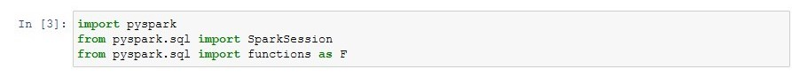
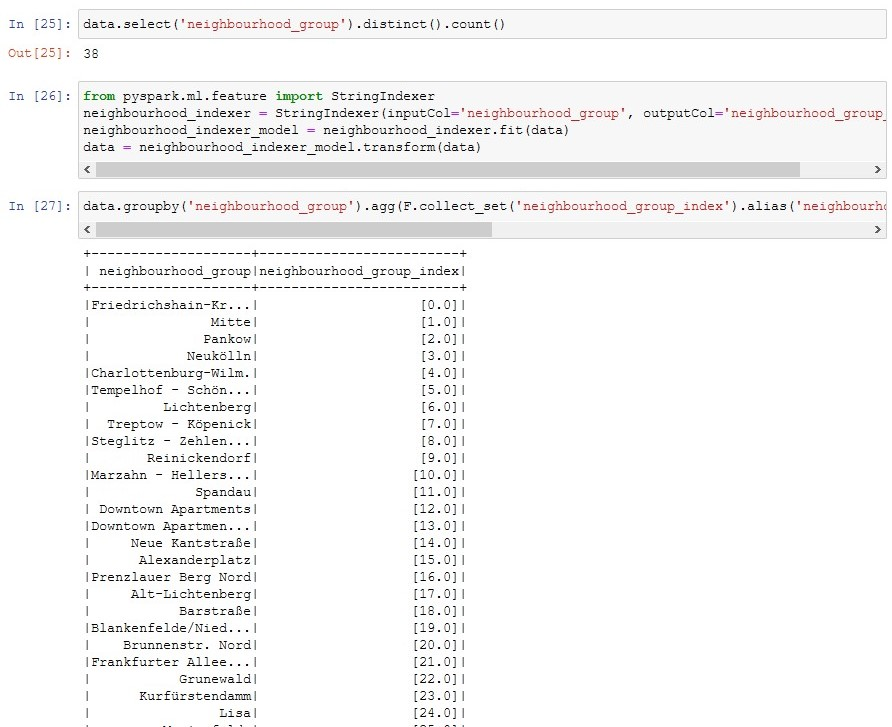
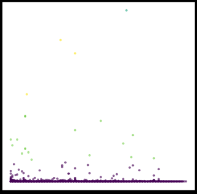

Author: Andreas Traut    
Date: 08.05.2020  (Updates 24.07.2020)  
[Download as PDF](https://github.com/AndreasTraut/Machine-Learning-with-Python/raw/master/Machine-Learning-with-Python_AndreasTraut.pdf)

[TOC]


# Machine Learning with Python

## 0. Introduction

### a) Aim of this repository: "Small Data" versus "Big Data"

After having learnt visualization techniques in Python (which I showed in my repository ["Visualization-of-Data-with-Python"](https://github.com/AndreasTraut/Visualization-of-Data-with-Python)), I started working on different datasets with the aim to learn and apply machine learning algorithms. I was particularly interested in better **understanding the differences and similarities of "Small Data" (Scikit-Learn) approaches versus the "Big Data" (Spark) approaches!**

Therefore I tried to focus more on this "comparison" question of "Small Data" coding vs "Big Data" coding instead of digging into too many details of each of these approaches. I haven't seen many comparisons of "Small Data" vs "Big Data" coding and I think understanding this is interesting and important. 

### b) Motivation for IDEs

I will use [Jupyter-Notebooks](https://jupyter.org/), which is a widespread standard today, but I will also use [Integrated Development Environments (IDEs)](https://de.wikipedia.org/wiki/Integrierte_Entwicklungsumgebung). The first Jupyter-Notebooks have been developed 5 years ago (in 2015). Since my first programming experience was more than 25 years ago (I started with [GW-Basic](https://de.wikipedia.org/wiki/GW-BASIC) then [Turbo-Pascal](https://de.wikipedia.org/wiki/Turbo_Pascal) and so on and I am also familiar with [MS-DOS](https://de.wikipedia.org/wiki/MS-DOS)). I quickly learnt the advantages of using Jupyter-Notebooks. **But** I missed the comfort of an [IDE](https://de.wikipedia.org/wiki/Integrierte_Entwicklungsumgebung) from the very first days!

Why is it important for me to mention the IDEs out so early in a learning process? In my opinion Jupyter-Notebooks are good for the first examinations of data and for documenting procedures and up to a certain degree also for sophisticated data science. But it might be a good idea to learn very early how to work with an IDE. Think about how to use what has been developed so far later in a bigger environment (for example a [Lambda-Architecture](https://de.wikipedia.org/wiki/Apache_Hadoop#Lambda-Architektur), but you can take whatever other environment, which requires robustness&stability). I point this out here, because after having read several e-Books and having participated in seminars I see that IDEs are not in the focus.  

Therefore: in my examples in this repository here I will also work with Python ".py" files. These ".py" can be executed in an IDE, like e.g. [Spyder-IDE](https://www.spyder-ide.org/), which can be downloaded for free and looks like this: 


### c) Structure of this repository

#### (i) First part: "Movies Database" example

Therefore the *first example* uses a [Jupyter-Notebook](https://jupyter.org/) in order to learn the standard procedures (e.g. data-cleaning & preparing, model-training,...). I worked on data converting movies and their revenues. 

#### (ii) Second part: Scikit-Learn Example ("Small Data")

The *second example* is for being used in an IDE (integrated developer environment), like the [Spyder-IDE](https://www.spyder-ide.org/) from the [Anaconda distribution](https://www.anaconda.com/) and apply the ["Scikit-Learn Python Machine Learning Library"](https://scikit-learn.org/stable/)  (you may call this example a "Small Data" example if you want). I will show you a typical structure for a machine-learning example and put it into a mind-map. The same structure will be applied on the third example. 

#### (iii) Third part: Spark Example ("Big Data")

The *third example* is a "Big Data" example and will use a [Docker environment](https://www.docker.com/) and apply the ["Apache Machine Learning Library"](https://spark.apache.org/mllib/), a scalable machine learning library. The mind-map from the second part will be extended and aligned to the second example. 

In this example I also show some *Big Data Visualizations techniques*, show how the *K-Means Clustering Algorithm in Apache Spark ML* works and explain the *Map-Reduce* programming model on a Word-Count example. 

#### (iv) Summary Mind-Map

I provide a summary mind-map, which possibly helps you to structure your code. There are lots of similarities between "Small Data" and "Big Data". 

#### (v) Digression (Excurs) to Big Data Visualization and K-Means Clustering Algorithm and Map-Reduce

In this Digression (Excurs) I will provide some examples for Big Data Visualization, K-Means Clustering and Map-Reduce. 

### d) Future learnings and coding & data sources 

For <u>all</u> of these topics various tutorials, documentation, coding examples and guidelines can be found in the internet **for free**! The Open Source Community is an incredible treasure trove and enrichment that positively drives many digital developments: [Scikit-Learn](https://github.com/scikit-learn/scikit-learn), [Apache Spark](https://github.com/apache/spark), [Spyder](https://github.com/spyder-ide/spyder), [GitHub](https://github.com/github), [Tensorflow](https://github.com/tensorflow/tensorflow) and also [Firefox](https://github.com/mozilla), [Signal](https://github.com/signalapp), [Threema](https://github.com/threema-ch), [Corona-Warnapp](https://github.com/corona-warn-app)... to be mentionned. There are many positive examples of sharing code and data "for free". 

<u>Coding:</u> 

If you Google for example *"how to prepare and clean the data with spark"*, you will find tons of documents around *"removing null values"* or *"encoders"* (like the OneHotEncoder for treating categorical inputs) or *"pipelines"* (for putting all the steps in an efficient, customizable order) so on. You will be overwhelmed of all this. Some resources to mention are the [official documentation](https://spark.apache.org/docs/latest/ml-guide.html) and a few more Github repositories like e.g. [tirthajyoti/Spark-with-Python](https://github.com/tirthajyoti/Spark-with-Python) (MIT licence), [Apress/learn-pyspark](https://github.com/Apress/learn-pyspark) (Freeware License), [mahmoudparsian/pyspark-tutorial](https://github.com/mahmoudparsian/pyspark-tutorial) (Apache License v2.0). What I will do here in my repository is nothing more than putting it together so that it works for my problem (which can be challenging as well sometimes). Adapting it for your needs should be easier from this point on. 

<u>Data:</u>

If you would like to do further analysis or produce alternate visualizations of the Airbnb-data, you can download them from [here](http://insideairbnb.com/get-the-data.html). It is available below under a [Creative Commons 1.0 Universal "Public Domain Dedication"](http://creativecommons.org/publicdomain/zero/1.0/) license. The data for the Vermont-Vendor-Payments can be downloaded from [here](https://data.vermont.gov/Finance/Vermont-Vendor-Payments/786x-sbp3) and are available under the [Open Data Commons Open Database License](http://opendatacommons.org/licenses/odbl/1.0/). The movies database doesn't even mention a license and is from [Kaggle](https://www.kaggle.com/isaactaylorofficial/imdb-10000-most-voted-feature-films-041118/metadata). There you find a lot of more datasets and also coding examples for your studies. 

## I. "Movies Database" Example 

A good starting point for finding useful datasets is "Kaggle" (www.kaggle.com). I downloaded the movies dataset from [here](https://www.kaggle.com/isaactaylorofficial/imdb-10000-most-voted-feature-films-041118). The dataset from Kaggle contains the following columns:

Rank | Title | Year | Score | Metascore | Genre | Vote | Director | Runtime | **Revenue** | Description | RevCat

In this example I want to predict the **"Revenue"** based on the other information, which I have for each movie (e.g. every movie has a year, a scoring, a title ...). There are some "NaN"-values in the column "Revenue" and instead of filling them with an assumption (e.g. median-value) as I did in another Jupiter-Notebook (see [here](https://github.com/AndreasTraut/Machine-Learning-with-Python/blob/master/Movies%20Machine%20Learning%20-%20StratifiedSample.ipynb)), I wanted to predict these values. You might guess the conclusion already: predicting the revenue based on the available information as shown above (the columns) might not work. But essential to me is more to follow a well established standard-process of data-cleaning, data-preparing, model-training and error-calculation in this example in order to learn how to apply this process to better datasets, than the movies-dataset, later. 

Therefore, here is how I approached the problem step-by-step: 

#### 1. Separate "NaN"-values

I separated the rows with "NaN"-values in column "Revenue"


#### 2. Draw a stratified sample

I drew a stratified sample (based on "Revenue") on this remaining dataset and I received a training dataset and testing dataset:


#### 3. Create a pipeline

I created a pipeline to fill the "NaN"-value in other columns (e.g. "Metascore", "Score").


#### 4. Fit the model

I used the training dataset and fitted it with the "DecisionTreeRegressor" model


#### 5. Cross-validation

I verified with a cross-validation, how good this model/parameters are


#### 6. Prediction 

I did a prediction on a subset of the testing dataset and did a side-by-side comparison of prediction and true value


I performed a prediction on the testing dataset and calculated the mean-squared error


#### 7. Conclusion 

The conclusion of this machine learning example is obvious: it is rather not possible to predict the "Revenue" based on the available information (the most useful numerical features were "year", "score", ... and the other categorical like "genre" don't seem to have much more added value in my opinion). 

Please find the complete Jupyter Notebook here: 

https://github.com/AndreasTraut/Machine-Learning-with-Python/blob/master/Movies%20Machine%20Learning%20-%20Predict%20NaNs.ipynb

If you want to run the code immediately without installing the required "Jupyter environment" then you can use this Deepnote-Link:  

https://beta.deepnote.com/project/754094f0-3c01-4c29-b2f3-e07f507da460


## II. "Small Data" Machine Learning using "Scikit-Learn"

In my opinion Jupyter Notebooks are **not** always the best environment for learning to code! I agree, that Jupyter Notebooks are nice for doing documentation of python code. It really looks beautiful. But I prefer debugging in an IDE instead of a Jupyter Notebook: having the possibility to set a breakpoint can be a pleasure for my nerves, specially if you have longer programs. Some of my longer Jupyter Notebooks feel from the hundreds line of code onwards more like pain than like anything helpful. And I also prefer having a "help window" or a "variable explorer", which is smoothly integrated into the IDE user interface. And there are a lot more advantages why getting familiar with an IDE is a big advantage compared to the very popular Jupyter Notebooks! I am very surprised, that everyone is talking about Jupyter Notebooks but IDEs are only mentioned very seldom. But maybe my preferences are also a bit different, because I grew up in a [MS-DOS](https://de.wikipedia.org/wiki/MS-DOS) environment. :-) 

I choose in this *second example* the [Spyder-IDE](https://www.spyder-ide.org/) and worked on "[Scikit-Learn](https://scikit-learn.org/stable/)", a very popular python machine learning library. The structure of the Python code is a bit similar to the steps, which I followed in the Movies Database example above (you will find these sections also in the ".py" file). 

So let's start with the "scikit-learn" ("SmallData", if you want). I will align this structure to the Spark "Big Data" mind map below in order to learn from each of this two approaches. 

{#fig:MindMapSmallData}

I aligned this "Small Data" structure to the Apache Spark "Big Data" structure in order to learn from each of this two approaches. Finally I will put these two Mind Maps into one big which you can take as a guide to navigate through all of your machine-learning problems.  

### Initialize and Read the CSV File

#### Define Auxiliary Variables and Functions

These auxiliary variables and auxiliary functions are intended to make your work easier: 

```python
PROJECT_ROOT_DIR = "."
myDataset_NAME = "AirBnB"
IMAGES_PATH = os.path.join(PROJECT_ROOT_DIR, "media")
myDataset_PATH = os.path.join("datasets", "AirBnB")

def save_fig(fig_id, prefix=myDataset_NAME, 
             tight_layout=True, fig_extension="png", resolution=300):
    path = os.path.join(IMAGES_PATH, prefix + "_" + fig_id + "." + fig_extension)
    print("Saving figure", prefix + "_" + fig_id)
    if tight_layout:
        plt.tight_layout()
    plt.savefig(path, format=fig_extension, dpi=resolution)
```

#### Read the csv-file

Define a function for reading the CSV file: 

```python
def load_myDataset_data(myDataset_path=myDataset_PATH):
    csv_path = os.path.join(myDataset_path, "listings.csv")
    return pd.read_csv(csv_path)

myDataset = load_myDataset_data()
print(myDataset.head())
```

The dataset has the following format (use `myDataset.info()`): 

```python
RangeIndex: 25164 entries, 0 to 25163
Data columns (total 15 columns):
 #   Column                          Non-Null Count  Dtype  
---  ------                          --------------  -----
 0   name                            25114 non-null  object 
 1   host_id                         25164 non-null  int64  
 2   host_name                       25142 non-null  object 
 3   neighbourhood_group             25164 non-null  object 
 4   neighbourhood                   25164 non-null  object 
 5   latitude                        25164 non-null  float64
 6   longitude                       25164 non-null  float64
 7   room_type                       25164 non-null  object 
 8   price                           25164 non-null  int64  
 9   minimum_nights                  25164 non-null  int64  
 10  number_of_reviews               25164 non-null  int64  
 11  last_review                     20636 non-null  object 
 12  reviews_per_month               20636 non-null  float64
 13  calculated_host_listings_count  25164 non-null  int64  
 14  availability_365                25164 non-null  int64  
dtypes: float64(3), int64(6), object(6)
```

### Split Training Data and Test Data

The aim if to predict the `price` and use the other columns (or some of them) as features. 

#### Generate Stratified Sampling

I want to create the training dataset and the test dataset by applying stratified sampling: 

```python
myDataset["price"].hist()
myDataset["price_cat"] = pd.cut(myDataset["price"],
                               bins=[-1, 50, 100, 200, 400, np.inf],
                               labels=[50, 100, 200, 400, 500])
print("\nvalue_counts\n", myDataset["price_cat"].value_counts())
myDataset["price_cat"].hist()

split = StratifiedShuffleSplit(n_splits=1, test_size=0.2, random_state=42)
for train_index, test_index in split.split(myDataset, myDataset["price_cat"]):
    strat_train_set = myDataset.loc[train_index]
    strat_test_set = myDataset.loc[test_index]
```


There is a very long tail in the price (going to about 9000). 


#### Verify if Stratified sample is good

Next step is to verify if the stratified sample is good and compare it to a random sampling

```python
def price_cat_proportions(data):
    return data["price_cat"].value_counts() / len(data)

train_set, test_set = train_test_split(myDataset, test_size=0.2, random_state=42)

compare_props = pd.DataFrame({
    "Overall": price_cat_proportions(myDataset),
    "Stratified": price_cat_proportions(strat_test_set),
    "Random": price_cat_proportions(test_set),
}).sort_index()

compare_props["Rand. %error"] = 100 * compare_props["Random"] / 
								compare_props["Overall"] - 100
compare_props["Strat. %error"] = 100 * compare_props["Stratified"] / 
								compare_props["Overall"] - 100
```

From the `%error` columns I can see, that the stratified sample is always better, than the random sampling.

```python
      Overall  Stratified    Random  Rand. %error  Strat. %error
50   0.533659    0.533678  0.536062      0.450249       0.003473
100  0.340168    0.340155  0.343731      1.047386      -0.003974
200  0.101256    0.101331  0.097755     -3.457526       0.074516
400  0.017326    0.017286  0.015498    -10.554013      -0.233322
500  0.007590    0.007550  0.006954     -8.380604      -0.527513
```

### Discover and Visualize the Data to Gain Insights

Now it it time to create some visualizations as I described in [@sec:Visualization]. The first plot it a bad example, because the big blue dots don't reveal any interesting information about the `price` (which was our prediction variable). 

```python
myDataset.plot(kind="scatter", 
               x="longitude", y="latitude", 
               title="bad_visualization_plot")
save_fig("bad_visualization_plot")
```


Better would be to include the price by a heat color: 

```python
myDataset.plot(kind="scatter", 
               x="longitude", y="latitude", 
               alpha=0.4, s=myDataset["price"]/100, 
               label="price", figsize=(10,7), 
               c="price", cmap=plt.get_cmap("jet"), 
               colorbar=True, sharex=False, 
               title="prices_scatterplot")
plt.legend()
save_fig("prices_scatterplot")
```


```python
attributes = ["number_of_reviews", "host_id", 
              "availability_365", "reviews_per_month"]
scatter_matrix(myDataset[attributes], 
               figsize=(12, 8))
plt.suptitle("scatter_matrix_plot")
save_fig("scatter_matrix_plot")
```


As I am interested in predicting the `price` I will calculate the correlation matrix in order to see, which column is most important: 

```python
corr_matrix = myDataset.corr()
print("correlation:\n", corr_matrix["price"].sort_values(ascending=False))
```

```python
correlation:
price                             1.000000
availability_365                  0.096979
calculated_host_listings_count    0.077545
host_id                           0.045434
reviews_per_month                 0.034332
latitude                          0.007836
number_of_reviews                 0.000611
minimum_nights                   -0.006361
longitude                        -0.036490
Name: price, dtype: float64
```

### Clean NULL-Values and Prepare for Machine Learning

#### Find all NULL-Values

```python
print("\nHow many Non-NULL rows are there?\n")
print(myDataset.info())
print("\nAre there NULL values in the columns?\n", 
      myDataset.isnull().any())
print("\nAre there NULLs in column reviews_per_month?\n",
      myDataset["reviews_per_month"].isnull().any())
print("\nShow some rows with NULL (head only):\n",
      myDataset[myDataset["reviews_per_month"].isnull()].head())
```

How many Non-Null rows are there?

```python
Data columns (total 14 columns):
 #   Column                          Non-Null Count  Dtype  
---  ------                          --------------  -----
 0   name                            20088 non-null  object 
 1   host_id                         20131 non-null  int64  
 2   host_name                       20114 non-null  object 
 3   neighbourhood_group             20131 non-null  object 
 4   neighbourhood                   20131 non-null  object 
 5   latitude                        20131 non-null  float64
 6   longitude                       20131 non-null  float64
 7   room_type                       20131 non-null  object 
 8   minimum_nights                  20131 non-null  int64  
 9   number_of_reviews               20131 non-null  int64  
 10  last_review                     16501 non-null  object 
 11  reviews_per_month               16501 non-null  float64
 12  calculated_host_listings_count  20131 non-null  int64  
 13  availability_365                20131 non-null  int64  
dtypes: float64(3), int64(5), object(6)
```

Are there NaN values in the columns?

```python
name                               True
host_id                           False
host_name                          True
neighbourhood_group               False
neighbourhood                     False
latitude                          False
longitude                         False
room_type                         False
minimum_nights                    False
number_of_reviews                 False
last_review                        True
reviews_per_month                  True
calculated_host_listings_count    False
availability_365                  False
```

#### Remove all NULL-Values

There are different options for handling NULL values, which occur in a column: 

Option 1: we can delete the entire row 

Option 2: we can delete the entire column 

Option 3: we can fill these with an assumption, like for example the median (which is a often a good assumption for filling NULL values, but not always, as we have seen in the movies database example). 

```python
sample_incomplete_rows = myDataset[myDataset.isnull().any(axis=1)] 

# option 1: remove rows which contains NaNs
# sample_incomplete_rows.dropna(subset=["total_bedrooms"])    

# option 2 : remove columns with contain NaNs
# sample_incomplete_rows.drop("total_bedrooms", axis=1)       

# option 3 : replace NaN by median
median = myDataset["reviews_per_month"].median()
sample_incomplete_rows["reviews_per_month"].fillna(median, inplace=True) 

print("sample_incomplete_rows\n", sample_incomplete_rows['reviews_per_month'].head())
```

```python
sample_incomplete_rows
24411    0.43
15700    0.43
9311     0.43
21882    0.43
24259    0.43
```

### Model-Specific Preprocessing

#### Use "Imputer" to Clean NULL-Values

 Remove all text attributes because median can only be calculated on numerical attributes

```python
imputer = SimpleImputer(strategy="median")
myDataset_num = myDataset.select_dtypes(include=[np.number]) #or: myDataset_num = myDataset.drop('ocean_proximity', axis=1) 
imputer.fit(myDataset_num)
print("\nimputer.strategy\n", 
      imputer.strategy)
print("\nimputer.statistics_\n", 
      imputer.statistics_)
print("\nmyDataset_num.median\n", 
      myDataset_num.median().values) 
print("\nmyDataset_num.mean\n", 
      myDataset_num.mean().values)  
```

```python
imputer.strategy
 median

imputer.statistics_
 [3.9804571e+07 5.2509580e+01 1.3416280e+01 3.0000000e+00 5.0000000e+00
 4.3000000e-01 1.0000000e+00 0.0000000e+00]

myDataset_num.median
 [3.9804571e+07 5.2509580e+01 1.3416280e+01 3.0000000e+00 5.0000000e+00
 4.3000000e-01 1.0000000e+00 0.0000000e+00]

myDataset_num.mean
 [7.74925763e+07 5.25100259e+01 1.34059193e+01 7.20863345e+00
 2.17043863e+01 1.02009696e+00 2.43967016e+00 7.33118573e+01]
```

Transform the training set:

```python
X = imputer.transform(myDataset_num) 
myDataset_tr = pd.DataFrame(X, columns=myDataset_num.columns,
                          index=myDataset.index)
myDataset_tr.loc[sample_incomplete_rows.index.values]
```

#### Treat "Categorial" Inputs

Use the OneHotEncoder for the categorial values: 

```python
myDataset_cat = myDataset[['room_type']]
print("myDataset_cat.head\n", myDataset_cat.head(10), "\n")

cat_encoder = OneHotEncoder()
myDataset_cat_1hot = cat_encoder.fit_transform(myDataset_cat)
print("cat_encoder.categories_:\n", cat_encoder.categories_)
print("myDataset_cat_1hot.toarray():\n", myDataset_cat_1hot.toarray())
print("myDataset_cat_1hot:\n", myDataset_cat_1hot)
```

```python
myDataset_cat.head
              room_type
5177      Private room
19616  Entire home/apt
10275     Private room
2078   Entire home/apt
23131  Entire home/apt
8408   Entire home/apt
17918  Entire home/apt
24411  Entire home/apt
8872      Private room
16064       Hotel room 

cat_encoder.categories_:
 [array(['Entire home/apt', 'Hotel room', 'Private room', 'Shared room'],
      dtype=object)]

myDataset_cat_1hot.toarray():
 [[0. 0. 1. 0.]
 [1. 0. 0. 0.]
 [0. 0. 1. 0.]
 ...
 [0. 0. 1. 0.]
 [0. 0. 1. 0.]
 [0. 0. 1. 0.]]
```

### Pipelines and Custom Transformer

#### Custom Transformer

```python
print("myDataset.columns\n", myDataset_num.columns)
number_of_reviews_ix, availability_365_ix, 
calculated_host_listings_count_ix, 
reviews_per_month_ix = [
    list(myDataset_num.columns).index(col)
    for col in ("number_of_reviews", "availability_365",
                "calculated_host_listings_count", 
                "reviews_per_month")]

def add_extra_features(X):
    number_reviews_dot_revievs_per_month = 
    X[:, number_of_reviews_ix] * X[:, reviews_per_month_ix]
    return np.c_[X, number_reviews_dot_revievs_per_month]

attr_adder = FunctionTransformer(add_extra_features, validate=False)
myDataset_extra_attribs = attr_adder.fit_transform(myDataset_num.values)

myDataset_extra_attribs = pd.DataFrame(
    myDataset_extra_attribs,
    columns=list(myDataset_num.columns)+["number_reviews_dot_revievs_per_month"],
    index=myDataset_num.index)
print("myDataset_extra_attribs.head()\n", myDataset_extra_attribs.head())
```

#### Pipelines 

```python
num_pipeline = Pipeline([
        ('imputer', SimpleImputer(strategy="median")),
        ('attribs_adder', FunctionTransformer(add_extra_features, 
                                              validate=False)),
        ('std_scaler', StandardScaler())])
myDataset_num_tr = num_pipeline.fit_transform(myDataset_num)
print("myDataset_num_tr\n", myDataset_num_tr)

num_attribs = list(myDataset_num)
cat_attribs = ["room_type"]

full_pipeline = ColumnTransformer([
        ("num", num_pipeline, num_attribs),
        ("cat", OneHotEncoder(), cat_attribs),
    ])
myDataset_prepared = full_pipeline.fit_transform(myDataset)
print("myDataset_prepared\n", myDataset_prepared)
```

### Select and Train Model

#### LinearRegression Model

```python
lin_reg = LinearRegression()
lin_reg.fit(myDataset_prepared, myDataset_labels)
some_data = myDataset.iloc[:10]
some_labels = myDataset_labels.iloc[:10]
some_data_prepared = full_pipeline.transform(some_data)
print("Predictions:\n", lin_reg.predict(some_data_prepared))
print("Labels:\n", list(some_labels)) 

myDataset_predictions = lin_reg.predict(myDataset_prepared)
lin_mse = mean_squared_error(myDataset_labels, myDataset_predictions)
lin_rmse = np.sqrt(lin_mse)
print("lin_rmse\n", lin_rmse)

print("mean of labels:\n", myDataset_labels.mean())
print("std deviation of labels:\n", myDataset_labels.std())
```

```python
Predictions:
 [ 40.29259797  89.54082186  45.36959079 101.64252692  82.68120391
  89.57892837  76.33903757  76.42930129  38.55979179 861.9719368 ]
Labels:
 [41, 190, 35, 50, 100, 60, 69, 80, 32, 140]
lin_rmse
 213.51224401460684
mean of labels:
 74.19313496597287
std deviation of labels:
 227.66240520718222
```

####  DecisionTreeRegressor Model

```python
tree_reg = DecisionTreeRegressor(random_state=42)
tree_reg.fit(myDataset_prepared, myDataset_labels)
myDataset_predictions = tree_reg.predict(myDataset_prepared)

tree_mse = mean_squared_error(myDataset_labels, myDataset_predictions)
tree_rmse = np.sqrt(tree_mse)
print("tree_rmse\n", tree_rmse)
```

```python
tree_rmse
 2.5907022436676304
```

### Crossvalidation

#### For DecisionTreeRegressor

```python
scores = cross_val_score(tree_reg, myDataset_prepared, 
                         myDataset_labels,
                         scoring="neg_mean_squared_error", 
                         cv=10)
tree_rmse_scores = np.sqrt(-scores)
def display_scores(scores):
    print("Scores:", scores)
    print("Mean:", scores.mean())
    print("Standard deviation:", scores.std())

display_scores(tree_rmse_scores)
```

```python
Scores: [137.8762754  312.21141325 218.18522714 237.35937087  72.91732588
  65.62821113 304.05961303  86.65346214 178.337086   207.20918128]
Mean: 182.0437166129294
Standard deviation: 85.6479894222897
```

####  For LinearRegression 

```python
lin_scores = cross_val_score(lin_reg, myDataset_prepared, 
                             myDataset_labels,
                             scoring="neg_mean_squared_error", 
                             cv=10)
lin_rmse_scores = np.sqrt(-lin_scores)
display_scores(lin_rmse_scores)
```

```python
Scores: [216.69779596 285.34262945 264.35619589 299.03183929 241.53524149
  78.73412537 208.49809202 186.28646055 147.62364622  91.09183577]
Mean: 201.91978620154234
Standard deviation: 72.64261021086485
```

#### For RandomForestRegressor

```python
forest_reg = RandomForestRegressor(n_estimators=10, random_state=42)
forest_reg.fit(myDataset_prepared, myDataset_labels)

myDataset_predictions = forest_reg.predict(myDataset_prepared)
forest_mse = mean_squared_error(myDataset_labels, myDataset_predictions)
forest_rmse = np.sqrt(forest_mse)
print("forest_rmse\n", forest_rmse)

forest_scores = cross_val_score(forest_reg, myDataset_prepared, 
                                myDataset_labels,
                                scoring="neg_mean_squared_error", 
                                cv=10)
forest_rmse_scores = np.sqrt(-forest_scores)
display_scores(forest_rmse_scores)
```

```python
forest_rmse
 59.973965336421536
Scores: [157.89997398 130.24045184 208.33415063 235.2803762   93.2680475
  51.26602041 138.75095351 194.70999772 114.94817824 152.59500511]
Mean: 147.72931551364474
Standard deviation: 52.34950554724271
```

### Save Model

```python
joblib.dump(forest_reg, "forest_reg.pkl")
# and later...
my_model_loaded = joblib.load("forest_reg.pkl")
```

### Optimize Model

#### GridSearchCV

##### 	 GridSearchCV on RandomForestRegressor

```python
param_grid = [
    {'n_estimators': [30, 40, 50], 'max_features': [2, 4, 6, 8, 10]},
    {'bootstrap': [False], 'n_estimators': [3, 10], 'max_features': [2, 3, 4]} ]

forest_reg = RandomForestRegressor(random_state=42)
grid_search = GridSearchCV(forest_reg, param_grid, cv=5,
                           scoring='neg_mean_squared_error', 
                           return_train_score=True)
grid_search.fit(myDataset_prepared, myDataset_labels)

print("Best Params: ", grid_search.best_params_)
print("Best Estimator: ", grid_search.best_estimator_)
print("\nResults (mean_test_score and params):")
cvres = grid_search.cv_results_
for mean_score, params in zip(cvres["mean_test_score"], cvres["params"]):
    print(np.sqrt(-mean_score), params)
```

```python
Best Params:  {'max_features': 6, 'n_estimators': 50}
Best Estimator:  RandomForestRegressor(max_features=6, n_estimators=50, random_state=42)

Results (mean_test_score and params):
141.45328245705397 {'max_features': 2, 'n_estimators': 30}
142.78195035217828 {'max_features': 2, 'n_estimators': 40}
142.37123716346338 {'max_features': 2, 'n_estimators': 50}
135.775474892488 {'max_features': 4, 'n_estimators': 30}
134.4190304245193 {'max_features': 4, 'n_estimators': 40}
135.55354286489987 {'max_features': 4, 'n_estimators': 50}
134.16110647203996 {'max_features': 6, 'n_estimators': 30}
134.1926275989663 {'max_features': 6, 'n_estimators': 40}
132.63913672411098 {'max_features': 6, 'n_estimators': 50}
136.15995027100854 {'max_features': 8, 'n_estimators': 30}
134.6124097344303 {'max_features': 8, 'n_estimators': 40}
133.2709123855618 {'max_features': 8, 'n_estimators': 50}
137.99385113493992 {'max_features': 10, 'n_estimators': 30}
137.62914189800856 {'max_features': 10, 'n_estimators': 40}
137.05278896563013 {'max_features': 10, 'n_estimators': 50}
163.96946102421438 {'bootstrap': False, 'max_features': 2, 'n_estimators': 3}
144.03648391473084 {'bootstrap': False, 'max_features': 2, 'n_estimators': 10}
149.43499632921868 {'bootstrap': False, 'max_features': 3, 'n_estimators': 3}
139.80926358472138 {'bootstrap': False, 'max_features': 3, 'n_estimators': 10}
143.39742710695754 {'bootstrap': False, 'max_features': 4, 'n_estimators': 3}
137.45096056556272 {'bootstrap': False, 'max_features': 4, 'n_estimators': 10}
```

##### 	 GridSearchCV on LinearRegressor

```python
param_grid = [
    {'fit_intercept': [True], 'n_jobs': [2, 4, 6, 8, 10]},
    {'normalize': [False], 'n_jobs': [3, 10]},
  ]

lin_reg = LinearRegression()
# train across 5 folds, that's a total of (12+6)*5=90 rounds of training 
lin_grid_search = GridSearchCV(lin_reg, param_grid, cv=5,
                           scoring='neg_mean_squared_error', 
                           return_train_score=True)
lin_grid_search.fit(myDataset_prepared, myDataset_labels)

print("Best Params: ", lin_grid_search.best_params_)
print("Best Estimator: ", lin_grid_search.best_estimator_)
print("\nResults (mean_test_score and params):")
cvres = lin_grid_search.cv_results_
for mean_score, params in zip(cvres["mean_test_score"], cvres["params"]):
    print(np.sqrt(-mean_score), params)
```

```python
Best Params:  {'fit_intercept': True, 'n_jobs': 2}
Best Estimator:  LinearRegression(n_jobs=2)

Results (mean_test_score and params):
214.25154731008828 {'fit_intercept': True, 'n_jobs': 2}
214.25154731008828 {'fit_intercept': True, 'n_jobs': 4}
214.25154731008828 {'fit_intercept': True, 'n_jobs': 6}
214.25154731008828 {'fit_intercept': True, 'n_jobs': 8}
214.25154731008828 {'fit_intercept': True, 'n_jobs': 10}
214.25154731008828 {'n_jobs': 3, 'normalize': False}
214.25154731008828 {'n_jobs': 10, 'normalize': False}
```

####  Randomized Search

```python
param_distribs = {
        'n_estimators': randint(low=1, high=200),
        'max_features': randint(low=1, high=8),
    }

forest_reg = RandomForestRegressor(random_state=42)
rnd_search = RandomizedSearchCV(forest_reg, 
                                param_distributions=param_distribs,
                                n_iter=10, cv=5, 
                                scoring='neg_mean_squared_error', 
                                random_state=42)
rnd_search.fit(myDataset_prepared, myDataset_labels)

print("Best Params: ", rnd_search.best_params_)
print("Best Estimator: ", rnd_search.best_estimator_)
print("\nResults (mean_test_score and params):")
cvres = rnd_search.cv_results_
for mean_score, params in zip(cvres["mean_test_score"], cvres["params"]):
    print(np.sqrt(-mean_score), params)
```

```python
Best Params:  {'max_features': 7, 'n_estimators': 180}
Best Estimator:  RandomForestRegressor(max_features=7, n_estimators=180, random_state=42)

Results (mean_test_score and params):
133.8480285550475 {'max_features': 7, 'n_estimators': 180}
136.57169310969803 {'max_features': 5, 'n_estimators': 15}
139.51632044685252 {'max_features': 3, 'n_estimators': 72}
137.1771768583531 {'max_features': 5, 'n_estimators': 21}
134.3830342778431 {'max_features': 7, 'n_estimators': 122}
139.33370530867487 {'max_features': 3, 'n_estimators': 75}
138.9071602851763 {'max_features': 3, 'n_estimators': 88}
135.5081501949792 {'max_features': 5, 'n_estimators': 100}
138.3278914625561 {'max_features': 3, 'n_estimators': 150}
184.05585159780387 {'max_features': 5, 'n_estimators': 2}
```


####  Analyze best models

```python
feature_importances = grid_search.best_estimator_.feature_importances_
print("feature_importances:\n", feature_importances)
extra_attribs = ["number_reviews_dot_revievs_per_month"]
cat_encoder = full_pipeline.named_transformers_["cat"]
cat_one_hot_attribs = list(cat_encoder.categories_[0])
attributes = num_attribs + extra_attribs + cat_one_hot_attribs
print("\nattributes:\n", attributes)
my_list = sorted(zip(feature_importances, attributes), reverse=True)
print("\nMost important features (think about removing features):")
print("\n".join('{}' for _ in range(len(my_list))).format(*my_list))
```

```python
feature_importances:
 [0.16069378 0.07746518 0.16413731 0.04363706 0.02335222 0.05394379
 0.10185993 0.17949253 0.04558588 0.00626952 0.13746286 0.00526594
 0.00083401]

attributes:
 ['host_id', 'latitude', 'longitude', 'minimum_nights', 'number_of_reviews', 'reviews_per_month', 'calculated_host_listings_count', 'availability_365', 'number_reviews_dot_revievs_per_month', 'Entire home/apt', 'Hotel room', 'Private room', 'Shared room']

Most important features (think about removing features):
(0.17949252977627858, 'availability_365')
(0.1641373056263463, 'longitude')
(0.16069378145971047, 'host_id')
(0.13746285698834157, 'Hotel room')
(0.10185992760999112, 'calculated_host_listings_count')
(0.07746518330470566, 'latitude')
(0.05394378731977807, 'reviews_per_month')
(0.04558587773390613, 'number_reviews_dot_revievs_per_month')
(0.043637064748633575, 'minimum_nights')
(0.023352218877592826, 'number_of_reviews')
(0.0062695183764503, 'Entire home/apt')
(0.0052659368947157795, 'Private room')
(0.0008340112835496431, 'Shared room')
```

### Evaluate final model on test dataset

```python
final_model = grid_search.best_estimator_
print("final_model:\n", final_model)

X_test = strat_test_set.drop("price", axis=1)
y_test = strat_test_set["price"].copy()

X_test_prepared = full_pipeline.transform(X_test)
final_predictions = final_model.predict(X_test_prepared)

final_mse = mean_squared_error(y_test, final_predictions)
final_rmse = np.sqrt(final_mse)

print ("final_predictions:\n", final_predictions )
print ("final_rmse:\n", final_rmse )

confidence = 0.95
squared_errors = (final_predictions - y_test) ** 2
mean = squared_errors.mean()
m = len(squared_errors)

# from scipy import stats
print("95% confidence interval: ", 
      np.sqrt(stats.t.interval(confidence, m - 1,
                         loc=np.mean(squared_errors),
                         scale=stats.sem(squared_errors)))
      )
```

```python
final_model:
 RandomForestRegressor(max_features=6, n_estimators=50, random_state=42)
final_predictions:
 [132.24  78.2   96.3  ...  75.66  51.2   47.04]
final_rmse:
 112.12588420446276
95% confidence interval:  [ 53.7497262  149.18242105]
```

## 


## III. "Big Data" Machine Learning using the "Spark ML Library"

This will be an example for a ["Big-Data"](https://de.wikipedia.org/wiki/Big_Data) environment and uses the ["Apache MLib"](https://spark.apache.org/mllib/) scalable machine learning library. Various tutorials, documentation, "code-fragments" and guidelines can be found in the internet **for free** (at least for your private use). The best is in my opinion the [official documentation](https://spark.apache.org/docs/latest/ml-guide.html). A few more helpful sources are the following GitHub repositories: 

- [tirthajyoti/Spark-with-Python](https://github.com/tirthajyoti/Spark-with-Python) (MIT license)
- [Apress/learn-pyspark](https://github.com/Apress/learn-pyspark) (Freeware License)
- [mahmoudparsian/pyspark-tutorial](https://github.com/mahmoudparsian/pyspark-tutorial) (Apache License v2.0)

Concerning the topic **"Big Data"** I want to add the following: I passed a certification as *"Data Scientist Specialized in Big Data Analytics"*. I must say: Understanding the concept of "Big-Data" and how to differentiate "standard" machine learning from a "scalable" environment is not easy. I recommend a separate training! Some steps are a bit similar to "scikit-learn" (e.g. data-cleaning, preprocessing), but the technical environment for running the code is different and also the code itself is different. 

I added a **"Digression (Excurs)"** at the end of this document which covers the topics *"Big Data Visualization"*, *"K-Means-Clustering in Spark"* and *"Map-Reduce"* (one of the [powerful programming models for Big Data](https://de.wikipedia.org/wiki/MapReduce)). 

Let's start with the structure, which I put into a mind map (you can download it from this repository). I aligned the structure to the SkLearn mind map above in order to learn from each of this two approaches. 

{#fig:MachineLearningMindMapBigData}

There are different ways to approach the Apache Spark and Hadoop environment: you can install it on your own computer (which I found rather difficult because of lack of user-friendly and easy understandable documentation). Or you can dive into a Cloud environment, like e.g. Microsoft Azure or Amazon EWS or Google Cloud and try to get a virtual machine up and running for your purposes. Have a look at my [documentation](https://github.com/AndreasTraut/Experiences-with-MicrosoftAzure), where I shared my experiences, which I had with Microsoft Azure [here](https://github.com/AndreasTraut/Experiences-with-MicrosoftAzure). 

For the following explanation I decided to use [Docker](https://www.docker.com/). What is Docker? Docker is *"an open-source project that automates the deployment of software applications inside containers by providing an additional layer of abstraction and automation of OS-level virtualization on Linux."* Learn from the [Docker-Curriculum](https://docker-curriculum.com/) how it works. I found an container, which had Apache Spark Version 3.0.0 and Hadoop 3.2 installed and built my machine-learning code (using pyspark) on top of this container. 

### Initialize and Read the CSV File

#### Get Ready with Docker

I shared my code and developments on Docker-Hub in the following repository [here](https://hub.docker.com/repository/docker/andreastraut/machine-learning-pyspark). After having installed the Docker application you will need to pull my "machine-learning-pyspark" image to your computer: 

`docker pull andreastraut/machine-learning-pyspark`

Then open Windows Powershell and type the following: 

`docker run -dp 8888:8888 andreastraut/machine-learning-pyspark:latest`


You will see in your Docker Dashborad that a container is running: 


After having opened your browser (e.g. Firefox-Browser), navigate to "localhost:8888" (8888 is the port, which will be opened). 


The folder "data" contains the datasets. If you would like to do further analysis or produce alternate visualizations of the Airbnb-data, you can download them from [here](http://insideairbnb.com/get-the-data.html). It is available below under a [Creative Commons CC0 1.0 Universal (CC0 1.0) "Public Domain Dedication"](http://creativecommons.org/publicdomain/zero/1.0/) license. The data for the Vermont-Vendor-Payments can be downloaded from [here](https://data.vermont.gov/Finance/Vermont-Vendor-Payments/786x-sbp3) and are available under the [Open Data Commons Open Database License](http://opendatacommons.org/licenses/odbl/1.0/). 

When you open the Jupyter-Notebook, you will see, that Apache Spark Version 3.0.0 and Hadoop Version 3.2 is installed:


#### 0. Initialize Spark

Initializing a Spark sessions works and reading a CSV file can by done with the following commands (see more documentation [here](https://spark.apache.org/docs/latest/api/python/pyspark.sql.html#pyspark.sql.SparkSession) and also have a look at a ["Get Started Guide"](https://spark.apache.org/docs/latest/sql-getting-started.html#starting-point-sparksession)):



##### 0.1 Create Spark Context and  Spark Session


##### 0.2 Read CSV


##### 0.3 Dataset Properties and some Select, Group and Aggregate Methods

After then the data-cleaning and data preparation (eliminating of null values, visualization techniques) work pretty similar to the "Small data" (Sklearn) approach. 

##### 0.4 Write as Parquet or CSV

If you want to persist (=save) your intermediate you can do it as follows: 


##### 0.5 Read Parquet

If you want to persist (=save) your intermediate you can do it as follows: 

```python
data.select(*data.columns[:-1]).write.format("parquet").save("data/inputdata_preprocessed.parquet", mode='overwrite')
data.select(*data.columns[:-1]).write.csv('data/inputdata_preprocessed.csv', mode='overwrite', header=True)
```

Reading works as follows: 

```python
filename = "data/inputdata_preprocessed.parquet"
data = spark.read.parquet(filename)
```

#### 1. Cleaning the data     

##### 1.2 Replacing and Casting  

```python
data = data.withColumn('price', F.regexp_replace('price','\$',''))
data = data.withColumn('price', F.regexp_replace('price',',',''))
data = data.withColumn('price', data['price'].cast('double'))
```

##### 1.3 Null-Values  

```python
print("{} missing values for price"
      .format(data
              .filter(F.isnull(data['price']))
              .count()))
```

```python
104 missing values for price
```

```python
data = data.fillna(0, subset='price')
```

```python
print("{} missing values for price".format(data.filter(F.isnull(data['price'])).count()))
```

```python
0 missing values for price
```

##### 1.4 String Values  

```python
string_types = [x[0] 
                for x in data.dtypes 
                if x[1] == 'string']
data.select(string_types).describe().show()
```

#### 2. Model-specific preprocessing    

##### 2.0 Check missing entries and define userdefined scatter plot  

##### 2.1 StringIndexer  

I included some examples of how features can be extracted, transformed and selected in the Jupyter-Notebook (see more documentation [here](https://spark.apache.org/docs/latest/ml-features.html)). Just to mention a few here: the ["StringIndexer"](https://spark.apache.org/docs/latest/ml-features.html#stringindexer), ["OneHotEncoder"](https://spark.apache.org/docs/latest/ml-features.html#onehotencoder) and ["VectorAssembler"](https://spark.apache.org/docs/latest/ml-features.html#vectorassembler) work as follows: 



##### 2.2 OntHotEncoder  


##### 2.3 VectorAssembler  


#### 3. Aligning and numerating Features and Labels    

##### 3.1 Aligning  

Aligning in this context means, that you use the variable `label` for the labeled column (here it is the "price" column) and the variable `feature_cols` for the features. 

```python
label = 'price' 
feature_cols = ['num_features', 
                'vec_label']
cols = feature_cols + ['label']
data_feat = data.withColumnRenamed(label,'label').select(cols)
```

```python
+------------+---------+-----+
|num_features|vec_label|label|
+------------+---------+-----+
|     [145.0]|   [90.0]| 90.0|
|      [27.0]|   [28.0]| 28.0|
|     [133.0]|  [125.0]|125.0|
|     [292.0]|   [33.0]| 33.0|
|      [8.0]|   [180.0]| 180.0|
+------------+---------+-----+
only showing top 5 rows
```

##### 3.2 Numerating  

```python
feat_len = len(numeric_attributes) + data.select('room_type','room_index').distinct().count() 
features = numeric_attributes  + [r[0] for r in data.select('room_type','room_index').distinct().collect()] 
feature_dict = dict(zip(range(0, feat_len), features))
```


#### 4. Pipelines  

```python
from pyspark.ml import Pipeline
pipeline = Pipeline(stages=[vec_num, 
                            vec_label])
pipeline_model = pipeline.fit(data)
```

If you want to work with another pipeline, then all you need is to replace the second line. For example into this: 

```python
pipeline = Pipeline(stages=[room_indexer, 
                            vec_num, 
                            vec_label])
```

#### 5. Training data and Testing data  

```python
data_train, data_test = data_feat.randomSplit([0.9,0.1], 
                                              seed=42)
```

This creates a random split into a training dataset `data_train` and the testing dataset `data_test`. Remember, that in the movies data example (see [@sec:MoviesDatabaseExample]) we used the stratified sample. 

#### 6. Apply models and evaluate    

##### 6.1 Ordinary Least Square Regression  

After having extracted, transformed and selected features you will want to apply some models, which are documented [here](https://spark.apache.org/docs/latest/ml-classification-regression.html), for example the ["OLS Regression](https://spark.apache.org/docs/latest/ml-classification-regression.html#linear-regression)": 


##### 6.2 Ridge Regression  

The coding syntax for the "Ridge Regression" and the  "Lasso Regression" are pretty similar (there are also the `fit` and the `transform` methods). Please read the official documentation in order to understanding the "Ridge Regression and the Lasso Regression"[^ridgelassoregression] in detail.

##### 6.3 Lasso Regression  

The coding syntax for the "Decision Tree" is pretty similar (there is also the `fit` and the `transform` method). Please read the official documentation in order to understanding the "Decision Tree"[^decisiontree] in detail.

#### 7. Minhash und Local-Sensitive-Hashing (LSH) 

see example: https://github.com/AndreasTraut/Deep_learning_explorations

## IV. Summary Mind-Map

To summarize the whole coding structure have a look at the following and also the provided mind-maps. My mind map below may help you to structure your code: 

{#fig:MachineLearningMindMapSummary}

## V. Digression (Excurs) to Big Data Visualization and K-Means Clustering Algorithm and Map-Reduce

| Digression (Excurs) to Big Data Visualization and K-Means Clustering Algorithm and Map-Reduce |
| :----------------------------------------------------------- |
| **(i) Big Data Visualization:** You will see a Jupyter-Notebook (which contains the Machine-Learning Code) and a folder named "data" (which contains the raw-data and preprocessed data). As you can see: I also worked on a 298 MB big csv-file (["Vermont_Vendor_Payments.csv"](https://data.vermont.gov/Finance/Vermont-Vendor-Payments/786x-sbp3)), which I couldn't open in Excel, because of the huge size. This file contains a list of all state of Vermont payments to vendors (Open Data Commons License) and has  more than 1.6 million lines (exactly 1'648'466 lines). I already mentioned in my repository ["Visualization-of-Data-with-Python"](https://github.com/AndreasTraut/Visualization-of-Data-with-Python), that the **visualization of big datasets** can be difficult when using "standard" office tools, like Excel. If you are not able to open such csv-files in Excel you have to find other solutions. One is to use PySpark which I will show you here. Another solution would have been to use the Excel built-in connection, [PowerQuery](https://support.microsoft.com/de-de/office/einf%C3%BChrung-in-microsoft-power-query-f%C3%BCr-excel-6e92e2f4-2079-4e1f-bad5-89f6269cd605) or something similar, maybe Access or whatever, which is not the topic here, because we also want to be able to apply machine-learning algorithms from the  [Spark Machine Learning Library](https://spark.apache.org/mllib/). And there are more benefits of using PySpark instead of Excel: it can handle distributed processing, it's a lot faster, you can use pipelines, it can read many file systems (not only csv), it can process real-time data. <br /><br />**(ii) K-Means Clustering Algorithm:** Additionally I worked on this dataset to show how the K-Means Clustering Algorithm can be applied by using the Spark Marchine-Learning Libary (see more documentation [here](https://spark.apache.org/docs/latest/ml-clustering.html#k-means)). I will show how the "Vermont Vendor Payments" dataset can be clustered. In the images below every color represents a differents cluster: <br /><br /><br />**(iii) Map-Reduce:** This is a programming model for generating big data sets with parallel distributed algorithm on a cluster. Map-Reduce is very important for Big Data and therefore I added some Jupyter-Notebooks to better understand how it works. Learn the basis of the *Map-Reduce* programming model from [here](https://de.wikipedia.org/wiki/MapReduce) and then have a look into my jupyter notebook for details. I used the very popular "Word Count" example in order to explain Map-Reduce in detail. <br/><br/>In another application of Map-Reduce I found the very popular **term frequencyinverse document frequency** (short **TF-idf**) very interesting (see [Wikipedia](https://en.wikipedia.org/wiki/Tf%E2%80%93idf)). This is a numerical statistic, which is often used in text-based recommender systems and for information retrieval. In my example I used the texts of "Moby Dick" and "Tom Sawyer". The result are two lists of most important words for each of these documents. This is what the TF-idf found:<br/>  Moby Dick: WHALE, AHAB, WHALES, SPERM, STUBB, QUEEQUEG, STRARBUCK, AYE<br />  Tom Sawyer: HUCK, TOMS, BECKY, SID, INJUN, POLLY, POTTER, THATCHER<br />Applications for using TF-idf are in the [information retrieval](https://en.wikipedia.org/wiki/Information_retrieval) or to classify documents. <br/><br/>Have a look into my notebook [here](https://hub.docker.com/repository/docker/andreastraut/machine-learning-pyspark ) to learn more about Big Data Visualization, K-Means Clustering Algorithm, Map-Reduce and TF-idf. |


---


# Creative Commons Attribution-NonCommercial-ShareAlike 4.0 International License


This work is licensed under the Creative Commons Attribution-NonCommercial-ShareAlike 4.0 International License. To view a copy of this license, visit http://creativecommons.org/licenses/by-nc-sa/4.0/ or send a letter to Creative Commons, PO Box 1866, Mountain View, CA 94042, USA.